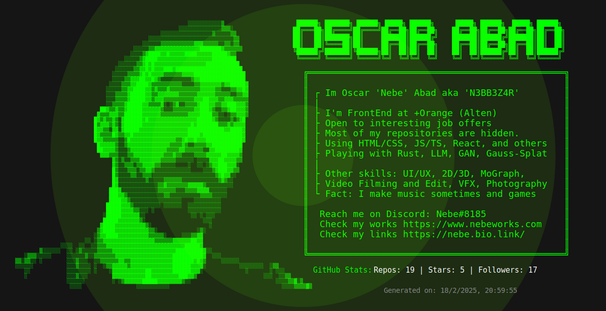

# About Me

<!-- - 👁️‍🗨️ I'm currently working at Zoega LTD. as FrontEnd Developer making a SPA Progressive Web Application with ReactJS, Typescript, API REST, Context, Router, Yup, VideoJS, Webcam recording, Payment Processors like Paxum, PXP, Stripe or SEPA/SWIFT, graphic stats with ChartJS, Drag and Drop, optimistic asynchronous, Biometrical verification with Veriff, CSS/SASS/Tailwind, Vite, MJML, AWS, Cognito and Lambda, Figma, AGILE with Sprints on JIRA, and Bitbucket, CI/CD workflow. Defining tasks amd coordinating Frontend team and requirements with Backend.
- 🔍 Open to interesting job offers.
- ℹ️ Most of my repositories are hidden or in other platforms like Bitbucket.
- 🔭 I’m currently using HTML, CSS/SASS, JS ES6+, Typescript, ReactJS, NextJS.
- 🌱 I’m currently playing with Rust, LLM, GAN, Gaussian Splatting...
- 💬 You can ask me also about Graphic Design: UI/UX, 2D, 3D, MoGraph, Video Filming and Edit, VFX, Photography or any other kind.
- 📫 Reach me on Discord: Nebe#8185
- ⚡ Fun fact: I make music sometimes. -->

* Check my other works at [https://www.nebeworks.com](https://www.nebeworks.com)
* Check my other links at [https://nebe.bio.link/](https://nebe.bio.link/)

<!--  -->

